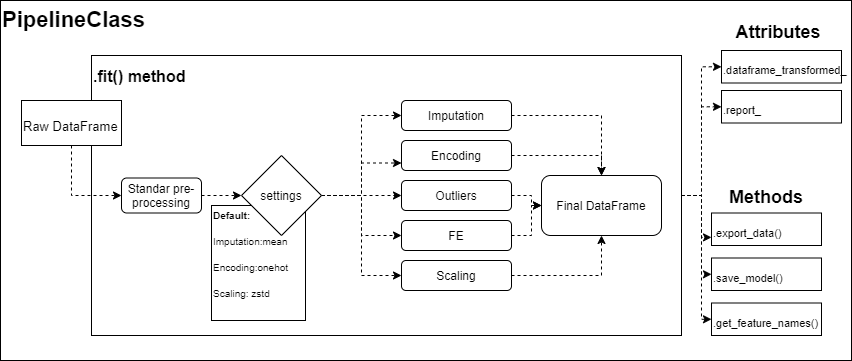

  [](https://github.com/Pipelines-team/Pipelines/issues)

This library corresponds to part of the work of <a href="https://www.buymeacoffee.com/sergiomorapardo" target="_blank"></a>:
 - [Sergio A. Mora Pardo](https://sergiomora03.github.io/)
 - [Miguel Arquez Abdala](https://github.com/abdala9512)
 
 **Contributors**
<a href="https://github.com/Pipelines-team/pipelines/graphs/contributors">
  
</a>

 
 **Languages and Tools:**
 
<code></code>
<code></code>
<code></code>
<code></code>


# Pipelines project 

  

Data Pipeline automatizado para  generar rápidamente features para un modelo de Machine learning de aprendizaje supervisado o no supervisado, contando con las siguiente características:

- Trabaja por tipo de datos, altamente parametrizado (Pero completamente automático si se requieren)
    - Imputación de datos ```( "impute:mean", "impute:median", "impute:mode")```
    - Reescalamiento ```("scale:zstd", "scale:norm", "scale:maxmin")```
    - Onehot encoding - Por defecto
    - feature encoding
    - Outlier treatment
- Entrega un reporte final con las transformaciones, y la nuevas dimensiones de las variables
- Genera atributos con el listado de todas las transformaciones en caso de querer hacer seguimiento
- Guarda el dataframe original

## Otras generalidades

**Inputs**: inicialmente trabaja con DataFrames solamente.

- Inicialmente no va procesar cadenas de texto ni  variables categóricas con N (por definir) o mas categorías ni columnas con clases ambiguas. Sin embargo, se podrá especificar el tipo de variable de cada columna (esto es importante, especialmente cuando se quiere distinguir entre nominales y ordinales)
- Eliminación de variables cuando estas no aporten variabilidad al modelo (umbrales de varianza mínimos requeridos, solo tienen una categoría)
- Limpieza de valores nulos bajo un umbral especifico (60% o mas de nulos puede ser un punto para empezar)
- El objeto en si mismo es un Pipeline, por lo que se puede ensamblar con modelos
- Podrá realizar particiones si lo desean (como train test split, pero por defecto solo aplica transformaciones)

# Estructura tentativa de la Clase inicial



- La herramienta esta pensada para que funcione muy bien con datawarehouses o bases de datos decentemente estructuradas para no entrar en detalles minuciosos de limpieza de datos. 
El procesamiento y limpieza de datos duros no será el fuerte del pipeline por lo que se recomienda un preprocesamiento antes de pasar la información (Cualquier resultado errado dependerá única y exclusivamente de la calidad de los datos que ingrese, aunque si el problema trasciende a la librería  estarán abiertos los issues)
- La compatibilidad está pensada para que sea con sklearn (Pero después el resultado es un dataframe de pandas independiente que puede ser usado como mejor lo convenga el usuario)

# Estructura de ejecución

```python
PipelineClass(
	impute = None, # imputacion de datos
	scale  = None, # Reescalamiento de datos
  dropna   = 0.9,
  numerical_feat = None,
  nominal_feat   = None,
  ordinal_feat   = None,
  drop_var       = 0.5,
  drop_col = [col_list],
  outlier = None, # Tambien pueden ser "IQR", Z-score, imputacion a la media o cosas por el estio
  y_var    = None, # Tratar de forma independiente a esta var en caso que exista
	split    = False, # porcentaje test_split
  feature_eng = None, # (column_names, "pca|tsne|nmf|")
  optim = None, # "reg,class,cluster,NN,multiclass"
  verbose = None,
  random_state = None
)

# Main methods and attributes

PipelineClass.get_feature_names() # Devuelve nombres de las nuevas variables
PipelineClass.fit(df) # Corre la transfomación de datos
PipelineClass.transformed_dataframe_
PipelineClass.report_
PipelineClass.raw_dataframe_
PipelineClass.export_data(format, path=None, column_names=True, index=False)
# Importante aca definir si es obligatorio el split por temas de data leakage y re utilización del pipeline
PipelineClass.save_pipeline(path, filename) 

# Example
"""
Tenemos un dataframe con información de multiples tipos,
con muchos NAs y que debe ser preparado para una predicción de clasificación
de un SVM de respuesta binaria
"""
my_pipeline = PipelineClass(
	impute = "impute:median",
  scale  = "scale:zstd",
  dropna = 0.75,
  dropvar = 0.1,
  drop_col ["non", "userful", "columns"],
  outlier = "IQR3:drop", # Otra opción puede ser "IQR2:impute" 
  nominal_feat = ["one", "hot", "encoded", "columns"],
  ordinal_feat = ["numerical", "categorization"],
  y_var = "My_prediction_var",
  split = 0.2, 
  random_state = 101,
  optim = "class",
  verbose = True # Indica qué se hace en cada proceso
)

# Todo esto debería poder ser envuelto en otro pipeline y correrse en conjunto con el SVM
my_pipeline.fit(raw_data_frame)
print(my_pipeline.report_)
newDataframe = my_pipeline.transformed_dataframe_

```
# Ideales en estructura y ejecución

Estos features son opcionales y definitivamente no los sugiero para la primera fase de la librería, pero me gustaría que pensáramos la estructura teniendo en cuenta que puede escalar por este camino:

- Un método que examine los datos antes de procesarlos y así se puede tomar la decisión de procesar lo que sirve y lo que no se bote o algo por el estilo.
- Para los métodos de imputación y re escalamiento de variables numéricas seria bueno una opción para personalizar qué variables se desean re-escalar de un método u otro. La primera approx. podría ser encadenar varios clases tipo pipeline con las columnas.
- Evaluar si esto funciona o podría extenderse (desde la misma clase) para NLP, Time Series, CV
- Por volumen de datos se podría pensar en una approx similar basada en c, c++, dask, rapids o spark, mas que todo para las implementaciones en paralelo
- Aun no tengo la lógica de de programación para todo un pipeline con tantos features, sería bueno explorar bien las opciones que nos ofrece sklearn.
- Estuve explorando cosas de Airflow, se podría construir un esqueleto con el flujo sugerido pero se podría personalizar a gusto el usuario
    - raw_dataframe → Limpieza básica, drop columnas (En paralelo ambos procesos), → Transformaciones (En paralelo) ya que cada columna es independiente de las demás → Dataframe final
- Feature extraction: Podria ser un parámetro para solucionar reducción de dimensionalidad (PCA, t-SNE, NMF) o transformaciones más sencillas o simples cálculos especificados por el usuario (custom transfomers, o simples sumas de columnas). También las columnas seleccionadas para Dimensionality reduction pueden ser elegidas por el usuario o seleccionadas automáticamente si una opción de FE se activa
- Parámetro de optimización dependiendo del problema: por ejemplo si el pipeline está pensado para modelos de respuesta binaria, multivariada, de variable continua o NN habría aspectos de FE o transformaciones que deberíamos optimizar (incluso si el algoritmo es no supervisado, como en clustering, asegurarnos que algunos pasos como el de reescalamiento estén resueltos con los argumentos por defecto y no trasladar la tarea al usuario)
- Tener opción para  guardar los datos en distintos archivos tipo, csv, sql, excel, S3, GCS para que adquiera utilidad como parte de un sistema

 ## Flujo de trabajo sugerido

No tengo mucho conocimiento pero podríamos enfocarnos en TDD (Test driven development), seleccionaríamos unos 2 o tres datasets de kaggle para probar los métodos y trabajaríamos sobre pruebas unitarias del código usado algún servicio de integración continua (Los más populares son TravisCI, CircleCI o jenkins)

Podemos dividir por features la arquitectura de la primera clase "PipelineClass" y trabajar en el método fit, que es el que demanda más trabajo y coordinación al tener tantas cosas, pienso nos apoyemos todo lo que podamos en métodos anónimos que alimenten a fit o modularizar en otras clases procesos importantes y luego llamarlos en la clase  "PipelineClass".

# Objectivo Final

Si bien esto puede tener pinta de "pet project" podría ser una buena solución de nivel de MLOps, he visto algunas empresas que hacen cosas similares, solo que agregan un modelo al final y unas conexiones a bases de datos al inicio con una interfaz bonita. bien optimizado esto podría llegar resultar en algo similar, pero mi opinión dándole fuerza a servicios adicionales como docker, lambda de AWS o Cloud functions de GCP.

# Primeros pipelines abordan:
## sklearn.preprocessing: Preprocessing and Normalization
The [sklearn.preprocessing](https://scikit-learn.org/stable/modules/classes.html#module-sklearn.preprocessing) module includes scaling, centering, normalization, binarization methods.

User guide: See the [Preprocessing data](https://scikit-learn.org/stable/modules/preprocessing.html#preprocessing) section for further details.

Metodo | Description
---|---
preprocessing.Binarizer(*[, threshold, copy]) | Binarize data (set feature values to 0 or 1) according to a threshold
preprocessing.FunctionTransformer([func, …]) | Constructs a transformer from an arbitrary callable.
preprocessing.KBinsDiscretizer([n_bins, …]) | Bin continuous data into intervals.
preprocessing.KernelCenterer() | Center a kernel matrix
preprocessing.LabelBinarizer(*[, neg_label, …]) | Binarize labels in a one-vs-all fashion
preprocessing.LabelEncoder | Encode target labels with value between 0 and n_classes-1.
preprocessing.MultiLabelBinarizer(*[, …]) | Transform between iterable of iterables and a multilabel format
preprocessing.MaxAbsScaler(*[, copy]) | Scale each feature by its maximum absolute value.
preprocessing.MinMaxScaler([feature_range, copy]) | Transform features by scaling each feature to a given range.
preprocessing.Normalizer([norm, copy]) | Normalize samples individually to unit norm.
preprocessing.OneHotEncoder(*[, categories, …]) | Encode categorical features as a one-hot numeric array.
preprocessing.OrdinalEncoder(*[, …]) | Encode categorical features as an integer array.
preprocessing.PolynomialFeatures([degree, …]) | Generate polynomial and interaction features.
preprocessing.PowerTransformer([method, …]) | Apply a power transform featurewise to make data more Gaussian-like.
preprocessing.QuantileTransformer(*[, …]) | Transform features using quantiles information.
preprocessing.RobustScaler(*[, …]) | Scale features using statistics that are robust to outliers.
preprocessing.StandardScaler(*[, copy, …]) | Standardize features by removing the mean and scaling to unit variance
preprocessing.add_dummy_feature(X[, value]) | Augment dataset with an additional dummy feature.
preprocessing.binarize(X, *[, threshold, copy]) | Boolean thresholding of array-like or scipy.sparse matrix
preprocessing.label_binarize(y, *, classes) | Binarize labels in a one-vs-all fashion
preprocessing.maxabs_scale(X, *[, axis, copy]) | Scale each feature to the [-1, 1] range without breaking the sparsity.
preprocessing.minmax_scale(X[, …]) | Transform features by scaling each feature to a given range.
preprocessing.normalize(X[, norm, axis, …]) | Scale input vectors individually to unit norm (vector length).
preprocessing.quantile_transform(X, *[, …]) | Transform features using quantiles information.
preprocessing.robust_scale(X, *[, axis, …]) | Standardize a dataset along any axis
preprocessing.scale(X, *[, axis, with_mean, …]) | Standardize a dataset along any axis
preprocessing.power_transform(X[, method, …]) | Power transforms are a family of parametric, monotonic transformations that are applied to make data more Gaussian-like.

Go Python! :facepunch:
